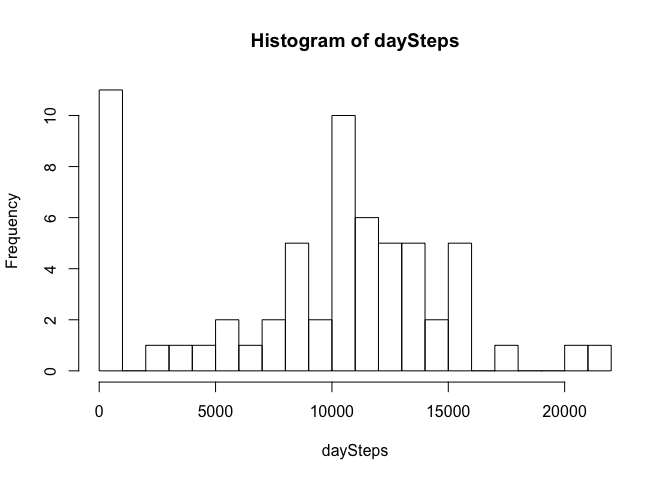
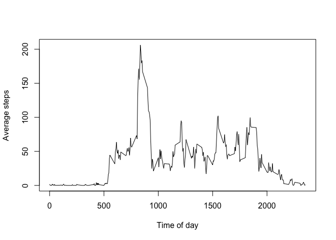
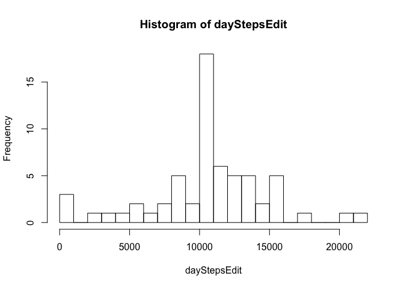
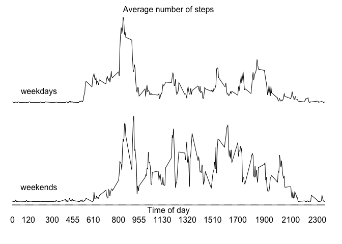

# Reproducible Research: Peer Assessment 1

## Load and preprocess the data
Read the data file and print the first few lines for inspection. 

```r
data <- read.csv("activity.csv")
head(data)
```

```
##   steps       date interval
## 1    NA 2012-10-01        0
## 2    NA 2012-10-01        5
## 3    NA 2012-10-01       10
## 4    NA 2012-10-01       15
## 5    NA 2012-10-01       20
## 6    NA 2012-10-01       25
```

Combine the date and interval variables into an R time object. Since strptime() cannot handle the hhmm format we will need to

1. Add leading zeros to the interval variable, 
1. Split it up into two segments with substr(), 
1. Feed into strptime() as %h%m (but format as POSIXlt), and 
1. Print the top of the array for inspection. 


```r
# Four element time format array: 
time <- sprintf('%04i', data$interval)
datetime <- as.POSIXlt(strptime(paste(data$date, 
            substr(time,1,2), substr(time,3,4)), 
            '%Y-%m-%d %H %M', tz="EST5EDT"))
head(datetime)
```

```
## [1] "2012-10-01 00:00:00 EDT" "2012-10-01 00:05:00 EDT"
## [3] "2012-10-01 00:10:00 EDT" "2012-10-01 00:15:00 EDT"
## [5] "2012-10-01 00:20:00 EDT" "2012-10-01 00:25:00 EDT"
```

How many days do our data cover? 

```r
difftime(tail(datetime, n=1), datetime[1])
```

```
## Time difference of 61.03819 days
```

## What is mean total number of steps taken per day?

First we need to index the array per day. 


```r
dayIndex <- seq(datetime[1], to=tail(datetime, n=1), by='day')
head(dayIndex)
```

```
## [1] "2012-10-01 EDT" "2012-10-02 EDT" "2012-10-03 EDT" "2012-10-04 EDT"
## [5] "2012-10-05 EDT" "2012-10-06 EDT"
```

And now count up the steps by day. A for loop is the quickest way I can think of but there is probably a smarter way. Start a zero vector first. 


```r
daySteps <- numeric(length(dayIndex))

for(i in 2:length(dayIndex)) {
    thisDay <- (datetime > dayIndex[i-1] & datetime < dayIndex[i])
    daySteps[i] = sum(data$steps[thisDay], na.rm=TRUE)
}
print(daySteps)
```

```
##  [1]     0     0   126 11352 12069 13294 15420 11015     0 12811  9866
## [12] 10304 17382 12426 15098 10139 15084 13452 10056 11829 10395  8821
## [23] 13450  8918  8355  2492  6778 10119 11458  5018  9819 15414     0
## [34] 10600 10571     0 10439  8109 13076  3251     0     0 12608 10765
## [45]  7336     0    41  5441 14339 15075  8841  4372 12787 20427 21194
## [56] 14478 11521 11475 13646 10183  7047     0
```

**The daily integer mean and median numbers of steps are:**


```r
round(mean(daySteps)); round(median(daySteps))
```

```
## [1] 9200
```

```
## [1] 10350
```

Now let's make a histogram with enough breaks to show the NA bar. 


```r
hist(daySteps, breaks=18)
```

 

## What is the average daily activity pattern?

First subset() to sort by time-step (0000, 0005, etc) and get the average according to the interval. 


```r
#byInterval <- data$steps[order(data$interval)]

nTimeSteps <- length(unique(data$interval))
avgByInterval <- numeric(length=nTimeSteps)

for(i in 1:nTimeSteps){
    avgByInterval[i] <- mean(subset(data, 
            interval==unique(interval)[i])[[1]], na.rm=TRUE)
}
```

Now plot the average daily activity pattern: 


```r
plot(avgByInterval ~ unique(interval), data=data, type='l', 
    xlab='Time of day', ylab='Average steps')
```

 

**The interval of highest activity is:**

```r
maxStepsTime <- unique(data$interval)[which.max(avgByInterval)]
sprintf('%04i', maxStepsTime)
```

```
## [1] "0835"
```

## Inputing missing values

Produce an index of missing values, print how many there are. Since only the steps variable includes NA we will ignore the rest of the data frame. 


```r
bad <- is.na(data$steps)
sum(bad)
```

```
## [1] 2304
```

Replace missing values with `avgByInterval`. First copy the data frame to a fresh one. 


```r
edited <- data
for(i in 1:length(data[[1]])){
    if(is.na(edited$steps[i])){
        myMatch <- match(edited$interval[i], 
                         unique(edited$interval))
        edited$steps[i] = avgByInterval[myMatch]
    }
}
```

Now repeat the daily average exercise with the mising data plugged with mean values. Use the dayIndex defined above. 


```r
dayStepsEdit <- daySteps
    
for(i in 2:length(dayIndex)) {
    thisDay <- (datetime > dayIndex[i-1] & datetime < dayIndex[i])
    dayStepsEdit[i] = sum(edited$steps[thisDay], na.rm=TRUE)
}
```

**The NA-free daily integer mean and median numbers of steps arethe same:**


```r
round(mean(dayStepsEdit)); round(median(dayStepsEdit))
```

```
## [1] 10588
```

```
## [1] 10754
```

And draw the histogram for the Edited dataset: 


```r
hist(dayStepsEdit, breaks=18)
```

 

Missing values were replaced by averages and therefore no difference came about in the above mean and medians. However, since NAs were counted in the first bin of the histogram (zero steps) the distinction between NA and zero in the edited dataset has now changed the shape of the histogram. 

## Are there differences in activity patterns between weekdays and weekends?

Produce an index of weekends instead of two separate factors. 

```r
wkend <- (weekdays(datetime) == "Sunday" | 
            weekdays(datetime) == "Saturday")
```

Since my `avgByInterval` tallied all days together we need to repeat it for weekends and weekdays separately. 


```r
avgByIntervalWkday <- numeric(length=nTimeSteps)
avgByIntervalWkend <- numeric(length=nTimeSteps)

for(i in 1:nTimeSteps){
    avgByIntervalWkday[i] <- mean(subset(data, 
        interval==unique(interval)[i] & !wkend)[[1]], na.rm=TRUE)
}

for(i in 1:nTimeSteps){
    avgByIntervalWkend[i] <- mean(subset(data, 
        interval==unique(interval)[i] & wkend)[[1]], na.rm=TRUE)
}
```

Plot the two time series. I will omit the y-axis since this is meant to qualitatively compare the two subsets. 


```r
# Make a 2-column grid
par(mfrow = c(2, 1))

# Minimise margins to maximise the plot area
par(mar = c(0, 0, 0.7, 0), oma = c(4, 0, 0.7, 0.5))

# Draw the two plots
plot(avgByIntervalWkday ~ unique(interval), data=data, type='l', 
    axes = FALSE)
# Add a label to indicate subset
text(200, y=30, 'weekdays')
# Add a title as margin text
mtext('Average number of steps', side=3)

plot(avgByIntervalWkend ~ unique(interval), data=data, type='l', 
    axes = FALSE)
text(200, y=30, 'weekends')

# Add a time axis
axis(1, at=unique(data$interval), tck=0)

# And label it
mtext("Time of day", side = 1)
```

 
